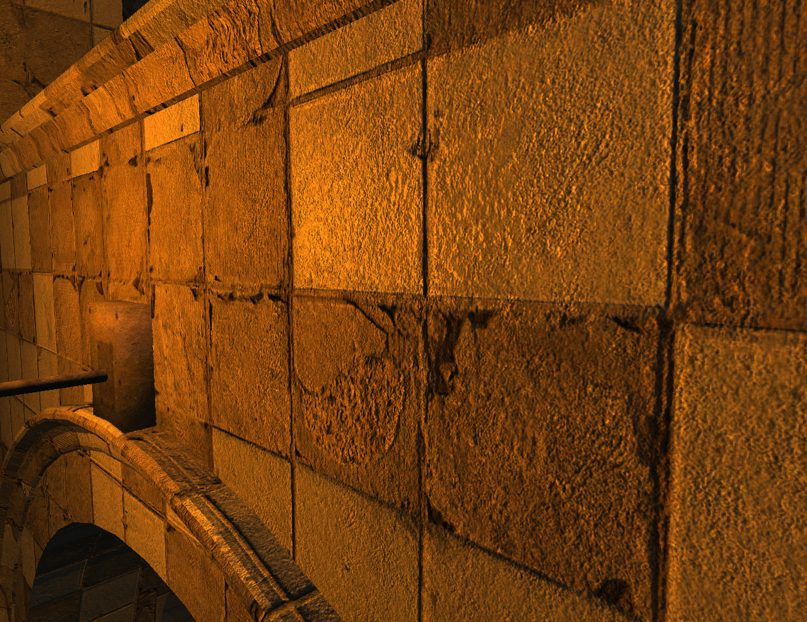
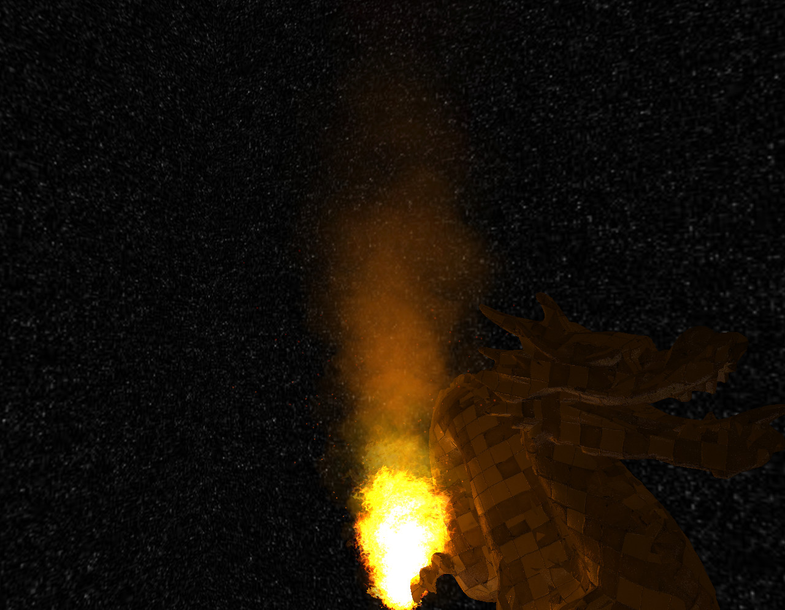
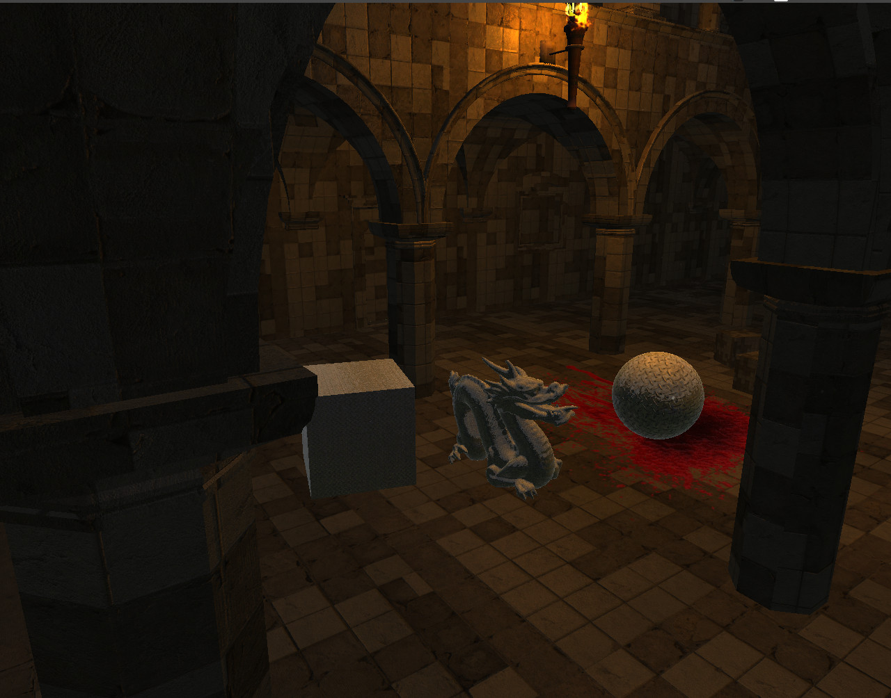
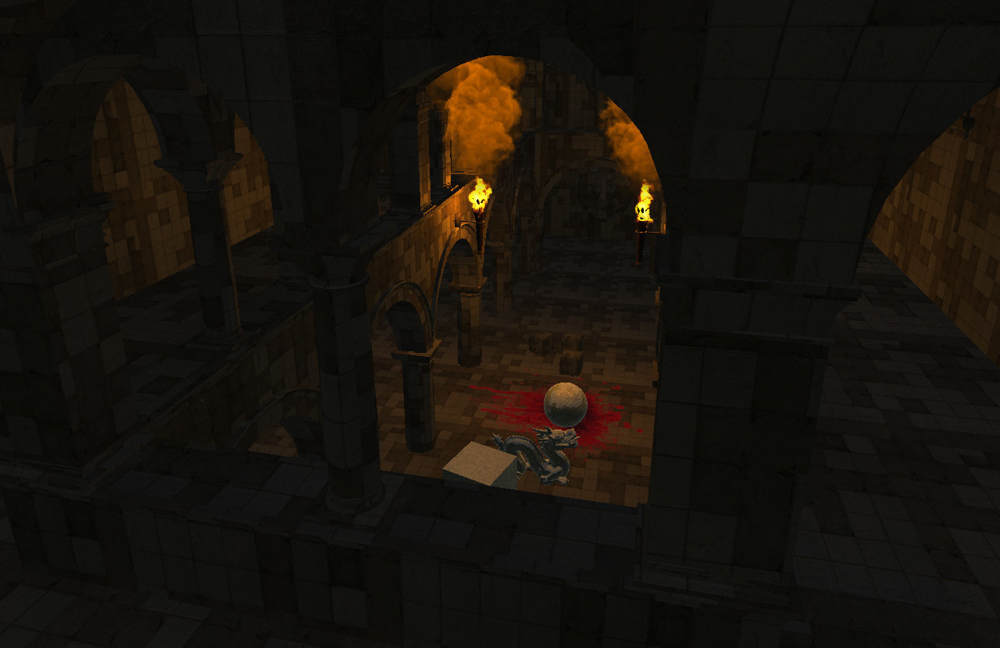

# Columbus Engine
3D cross-platform engine, written in C++14
## Columbus Engine can:
* Load 3D models from CMF format (may be compressed)
* Load images from DDS, PNG, JPEG, TGA, BMP and TIFF formats
* Write images to PNG, JPEG, TGA, BMP, TIFF formats
* Parse XML files
* Flexible Material and Shader system (in work)
* Audio system with high perfomance 3D sound (soon audio effects)
* Graphics System (in work)
* Rigidbody physics based on Bullet Physics
* Input System
* Scene manager
* Advanced Entity-Component System
* Advanced Particle Effect System (70% progress)
* Advanced Math Lib (vec2, vec3, vec4, mat4)

## OpenGL 3.0 renderer

## Tests

