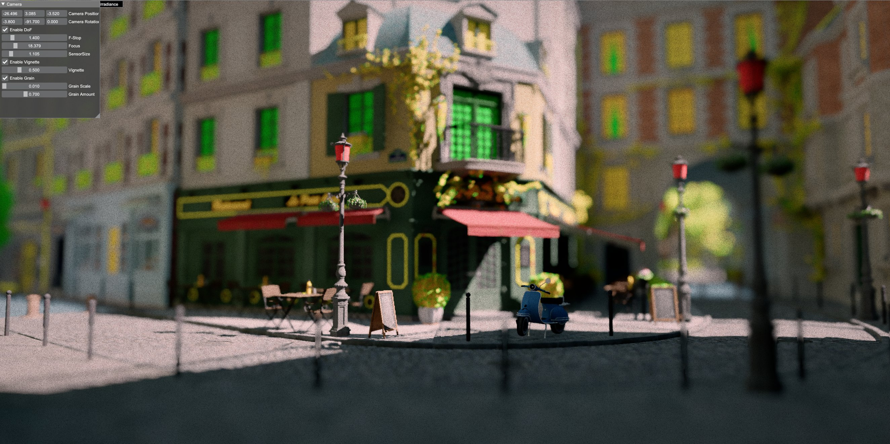
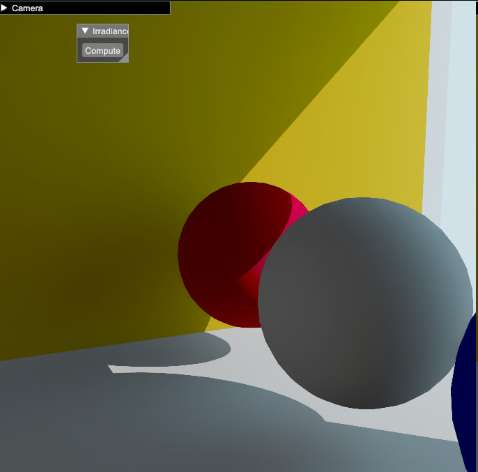

# Columbus Engine

3D experimental rendering engine

## Columbus Engine features

* RenderGraph based renderer
* Reference GPU path tracer
* Real-time deferred renderer
* Deferred decals
* Ray-traced shadows with variable-sized penumbra
* Static GI: lightmaps, irradiance volumes
* Dynamic GI: Ray Traced first-bounce with irradiance caching and SVGF-ish denoising
* RT Reflections (can optionally use irradiance cache)
* AgX and ACES (simplified) image formation
* TAA with neighbourhood clamping
* Bokeh DoF (FFX)
* Vignette and Film grain

## RTGI

Implementation described here
https://columbusutrigas.com/posts/rtgi/

## Supports

* Vulkan 1.3, Vulkan Ray Tracing

## Showcase

