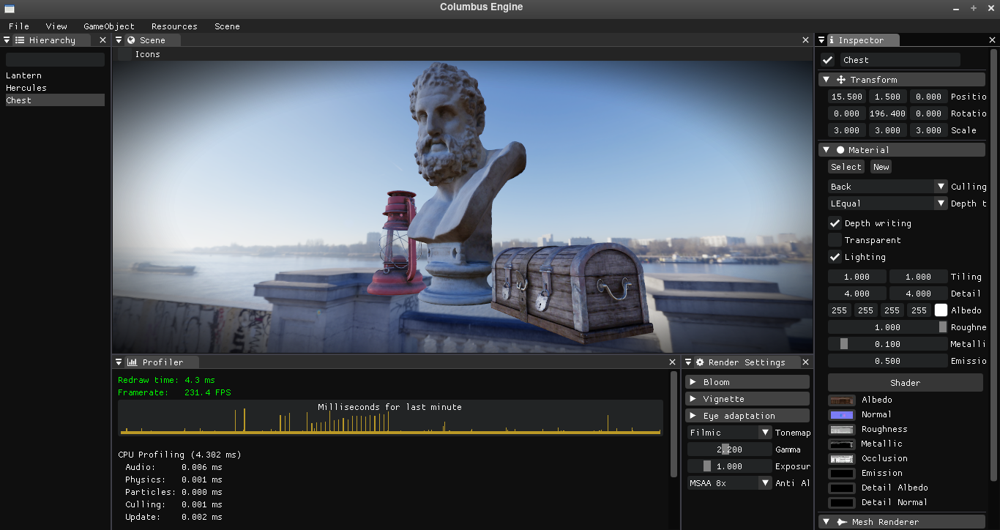

# Columbus Engine
3D cross-platform engine, written in C++14
## Columbus Engine features:
* Own 3D model format called CMF
* Loading images from DDS, HDR, PNG, JPEG, TGA, BMP and TIFF formats
* Parsing JSON and XML files
* Flexible Material and Shader system
* Physically Based HDR forward rendering
* Audio system with high perfomance 3D sound (soon audio effects)
* Advanced graphics system
* Rigidbody physics based on Bullet Physics
* Input System
* Scene manager
* Advanced Particle Effect System (70% progress)
* Advanced Math Lib (vec2, vec3, vec4, mat4)

## OpenGL 3.0 renderer

## Tests

