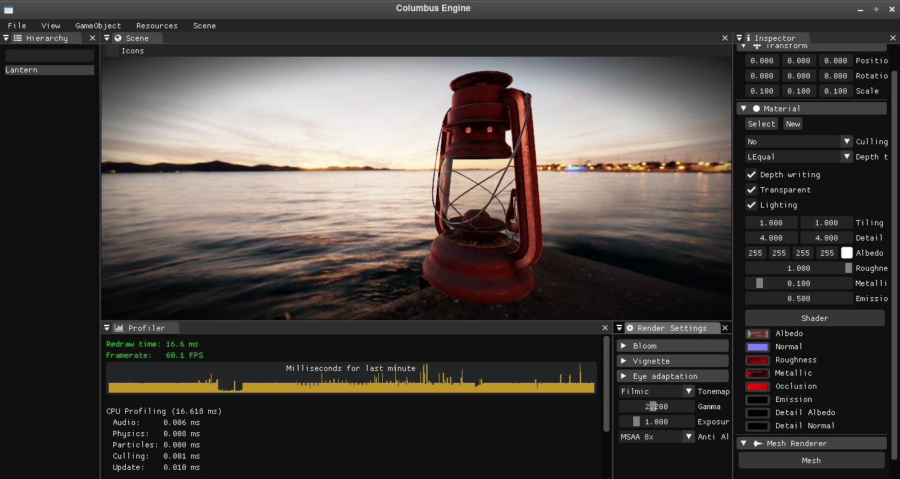
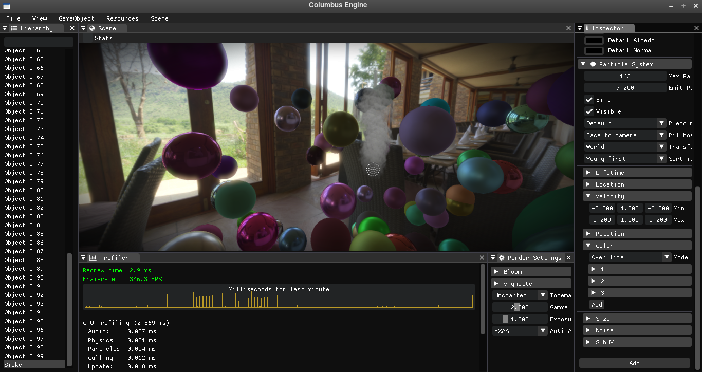

# Columbus Engine
3D cross-platform engine, written in C++14
## Columbus Engine features:
* Own 3D model format called CMF
* Loading images from DDS, HDR, EXR, PNG, JPEG, TGA, BMP and TIFF formats
* Parsing JSON files
* Flexible Material and Shader system
* Physically Based HDR forward rendering
* Audio system with high perfomance 3D sound (soon audio effects)
* Advanced graphics system
* Rigidbody physics based on Bullet Physics
* Input System
* Scene manager
* Advanced Particle Effect System
* Advanced Math Lib (Vector, Matrices, Quaternions)
* Postprocessing (Bloom, Vignette, Different Tonemapping techinques)
* Antialiasing (FXAA, MSAA)
* Integrated CPU and GPU profiler
* Editor based on ImGui

## Supports:
* OpenGL 3.3 Core Profile

## Tests

